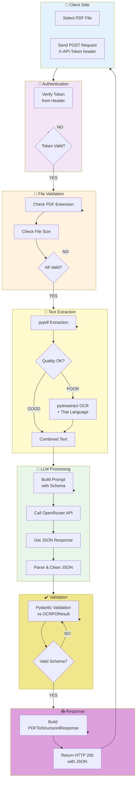
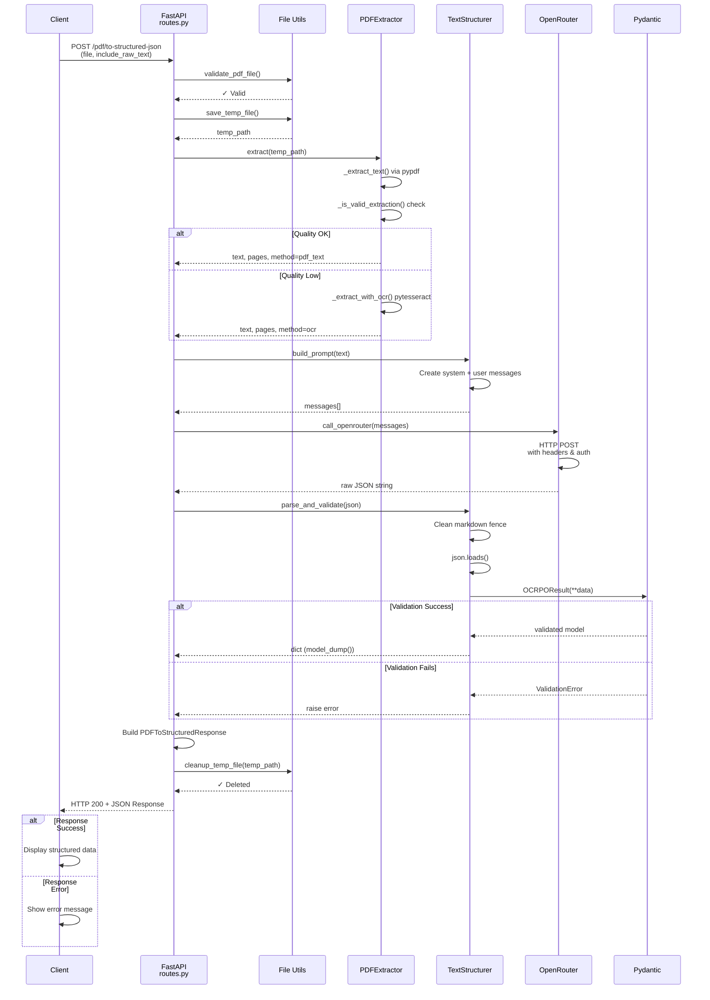

## Mermaid Code - Main Flow (Simplified for draw.io)

Copy ทั้งก้อนใส่ใน draw.io ได้เลย:

```mermaid
flowchart TD
    Start([START]) --> Upload[Upload PDF File<br/>from Client]

    Upload --> ValidateFile{Validate File<br/>Size limit 20MB<br/>Extension .pdf}

    ValidateFile -->|FAIL| Error1[❌ HTTP 400/413<br/>Invalid File]
    Error1 --> End1([END])

    ValidateFile -->|PASS| SaveTemp[Save Temp File]

    SaveTemp --> ExtractModule[PDFExtractor.extract]

    ExtractModule --> TryText[Try pypdf<br/>Text Extraction]

    TryText --> CheckThai{Check Quality<br/>Length >= 10<br/>Thai Chars >= 10%}

    CheckThai -->|VALID| UseText[✓ Use PDF Text<br/>method=pdf_text]

    CheckThai -->|INVALID| FallbackOCR[Fallback to OCR]

    FallbackOCR --> OCREngine[fitz + pytesseract<br/>Thai Language Pack<br/>zoom 2x = 144 DPI]

    OCREngine --> UseOCR[✓ Use OCR<br/>method=ocr]

    UseText --> CombinedText[Get Combined Text<br/>+ Pages Array<br/>+ Page Count]
    UseOCR --> CombinedText

    CombinedText --> BuildPrompt[TextStructurer<br/>build_prompt]

    BuildPrompt --> PromptFmt[System Prompt<br/>with JSON Schema]

    PromptFmt --> UserPrompt[User Prompt<br/>Raw Text]

    UserPrompt --> CallLLM[OpenRouterClient<br/>call_openrouter]

    CallLLM --> LLMConfig[Config:<br/>gpt-4o-mini<br/>Temp=0.0<br/>Timeout=60s]

    LLMConfig --> HTTPCall[HTTP POST to<br/>openrouter.ai/api/v1/chat/completions]

    HTTPCall -->|ERROR| TryFallback[Try Fallback Models<br/>gpt-3.5-turbo<br/>claude-3-haiku]

    TryFallback -->|FAIL| Error2[❌ HTTP 502/504<br/>LLM Error]
    Error2 --> Cleanup1[Cleanup Temp]
    Cleanup1 --> End2([END])

    HTTPCall -->|SUCCESS| RawJSON[Get JSON String]
    TryFallback -->|SUCCESS| RawJSON

    RawJSON --> ParseVal[TextStructurer<br/>parse_and_validate]

    ParseVal --> CleanMD[Remove Markdown<br/>Fences if exist]

    CleanMD --> JSONParse[json.loads]

    JSONParse -->|ERROR| Error3[❌ HTTP 502<br/>Invalid JSON]
    Error3 --> Cleanup1

    JSONParse -->|SUCCESS| PydanticVal[Validate with<br/>Pydantic Schema<br/>OCRPOResult]

    PydanticVal -->|INVALID| Error4[❌ HTTP 422<br/>Schema Error]
    Error4 --> Cleanup1

    PydanticVal -->|VALID| BuildResp[Build Success<br/>Response<br/>PDFToStructuredResponse]

    BuildResp --> RespData[Response Data:<br/>ocr metadata<br/>+ structured PO<br/>+ processing time]

    RespData --> Return200[✓ HTTP 200<br/>Return JSON]

    Return200 --> Cleanup2[Cleanup Temp]
    Cleanup2 --> End3[✓ END]

    style Start fill:#90EE90
    style End1 fill:#FFB6C6
    style End2 fill:#FFB6C6
    style End3 fill:#90EE90
    style Error1 fill:#FFB6C6
    style Error2 fill:#FFB6C6
    style Error3 fill:#FFB6C6
    style Error4 fill:#FFB6C6
    style ValidateFile fill:#87CEEB
    style CheckThai fill:#87CEEB
    style PydanticVal fill:#87CEEB
    style UseText fill:#FFFFE0
    style UseOCR fill:#FFFFE0
    style BuildResp fill:#DDA0DD
    style Return200 fill:#DDA0DD
```

---

## Alternative: Swimlane Style (Client-Server)

```mermaid
flowchart TD
    subgraph CLIENT["📱 Client Side"]
        A["Select PDF File"]
        B["Send POST Request<br/>X-API-Token header"]
    end

    subgraph API_AUTH["🔐 Authentication"]
        C["Verify Token<br/>from Header"]
        D{Token Valid?}
    end

    subgraph API_VALIDATE["📂 File Validation"]
        E[Check PDF Extension]
        F[Check File Size]
        G{All Valid?}
    end

    subgraph TEXT_EXTRACT["📄 Text Extraction"]
        H["pypdf Extraction"]
        I{Quality OK?}
        J["pytesseract OCR<br/>+ Thai Language"]
        K["Combined Text"]
    end

    subgraph LLM_PROCESS["🤖 LLM Processing"]
        L["Build Prompt<br/>with Schema"]
        M["Call OpenRouter API"]
        N["Get JSON Response"]
        O["Parse & Clean JSON"]
    end

    subgraph VALIDATION["✔️ Validation"]
        P["Pydantic Validation<br/>vs OCRPOResult"]
        Q{Valid Schema?}
    end

    subgraph RESPONSE["📤 Response"]
        R["Build PDFToStructuredResponse"]
        S["Return HTTP 200<br/>with JSON"]
    end

    CLIENT --> API_AUTH
    API_AUTH --> D
    D -->|NO| API_AUTH
    D -->|YES| API_VALIDATE
    API_VALIDATE --> E --> F --> G
    G -->|NO| API_VALIDATE
    G -->|YES| TEXT_EXTRACT
    TEXT_EXTRACT --> H --> I
    I -->|POOR| J
    I -->|GOOD| K
    J --> K
    K --> LLM_PROCESS
    LLM_PROCESS --> L --> M --> N --> O
    O --> VALIDATION
    VALIDATION --> P --> Q
    Q -->|NO| P
    Q -->|YES| RESPONSE
    RESPONSE --> R --> S
    S --> CLIENT

    style CLIENT fill:#E3F2FD
    style API_AUTH fill:#F3E5F5
    style API_VALIDATE fill:#FFF3E0
    style TEXT_EXTRACT fill:#FFFACD
    style LLM_PROCESS fill:#E8F5E9
    style VALIDATION fill:#F0E68C
    style RESPONSE fill:#DDA0DD
```

---

## Sequence Diagram (Detailed Interactions)

```mermaid
sequenceDiagram
    participant C as Client
    participant API as FastAPI<br/>routes.py
    participant FILE as File Utils
    participant EXT as PDFExtractor
    participant STR as TextStructurer
    participant OR as OpenRouter
    participant PYDANTIC as Pydantic

    C->>API: POST /pdf/to-structured-json<br/>(file, include_raw_text)
    API->>FILE: validate_pdf_file()
    FILE-->>API: ✓ Valid

    API->>FILE: save_temp_file()
    FILE-->>API: temp_path

    API->>EXT: extract(temp_path)

    EXT->>EXT: _extract_text() via pypdf
    EXT->>EXT: _is_valid_extraction() check

    alt Quality OK
        EXT-->>API: text, pages, method=pdf_text
    else Quality Low
        EXT->>EXT: _extract_with_ocr() pytesseract
        EXT-->>API: text, pages, method=ocr
    end

    API->>STR: build_prompt(text)
    STR->>STR: Create system + user messages
    STR-->>API: messages[]

    API->>OR: call_openrouter(messages)
    OR->>OR: HTTP POST<br/>with headers & auth
    OR-->>API: raw JSON string

    API->>STR: parse_and_validate(json)
    STR->>STR: Clean markdown fence
    STR->>STR: json.loads()
    STR->>PYDANTIC: OCRPOResult(**data)

    alt Validation Success
        PYDANTIC-->>STR: validated model
        STR-->>API: dict (model_dump())
    else Validation Fails
        PYDANTIC-->>STR: ValidationError
        STR-->>API: raise error
    end

    API->>API: Build PDFToStructuredResponse
    API->>FILE: cleanup_temp_file(temp_path)
    FILE-->>API: ✓ Deleted

    API-->>C: HTTP 200 + JSON Response

    alt Response Success
        C->>C: Display structured data
    else Response Error
        C->>C: Show error message
    end
```
